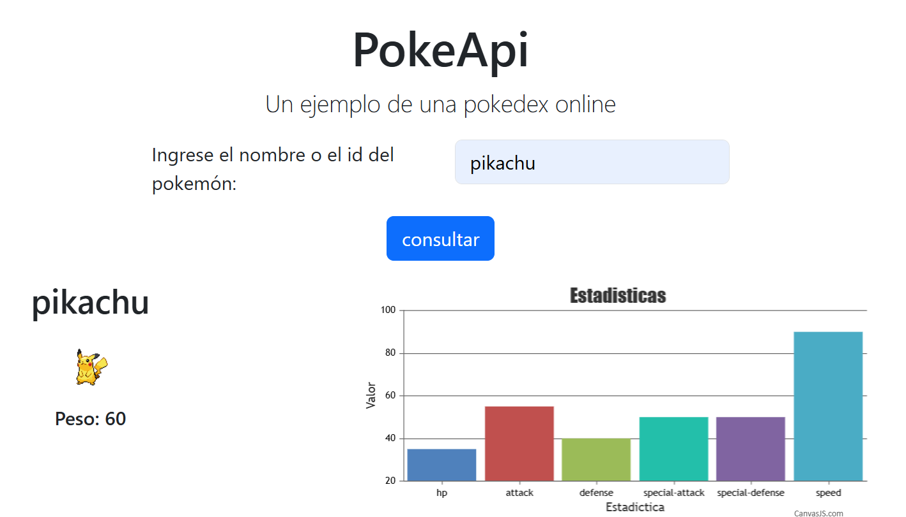

# Pokedex

### Descripción
  Pokedex es un proyecto creado con JavaScript que consume la API PokeAPI para mostrar información sobre los Pokémons. Además, incluye gráficas interactivas generadas con CanvasJS que presentan las estadísticas de los Pokémons.

### Características

* Consumo de API: Utiliza AJAX para obtener datos en tiempo real desde PokeAPI.
* Visualización de Pokémons: Muestra información como el nombre, la imagen y el peso del Pokémon seleccionado.
* Gráficas interactivas: Presenta las estadísticas de los Pokémons en un gráfico de columnas con CanvasJS.
* Diseño responsivo: Estilo adaptado con Bootstrap para una mejor experiencia en diferentes dispositivos.

### Tecnologías utilizadas

* HTML5: Estructura del proyecto.
* CSS3: Estilizado básico.
* Bootstrap 5: Para el diseño y la responsividad.
* JavaScript (jQuery): Lógica y manejo de AJAX.
* CanvasJS: Generación de gráficas interactivas.
* PokeAPI: Fuente de datos para la información de los Pokémons.

### Uso

* Ingresa el nombre o ID de un Pokémon en el campo de texto.
* Haz clic en el botón Consultar.

